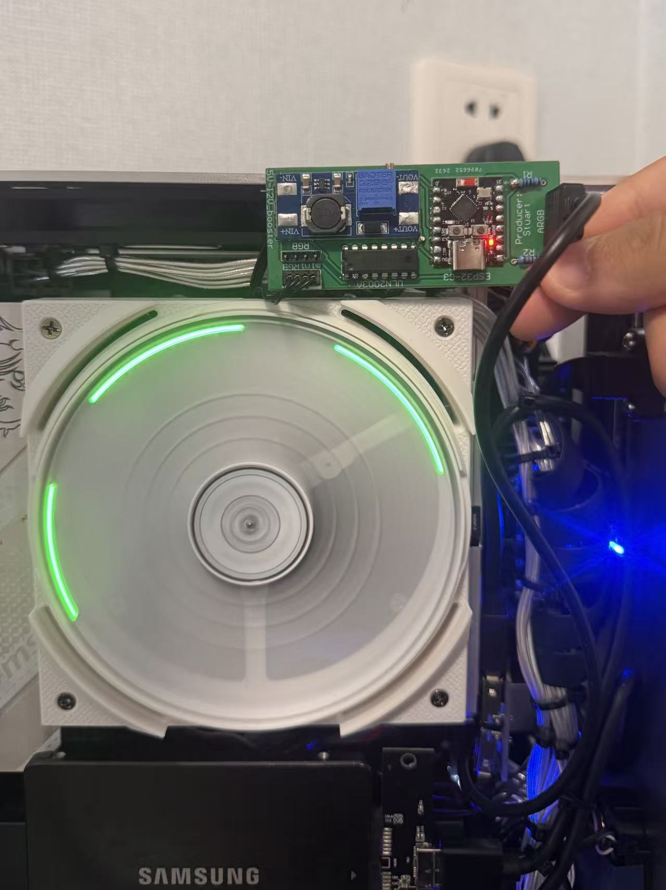

# ARGB → 12V RGB Converter (ESP32-C3)

Convert a motherboard's **5 V ARGB** signal (3-pin, WS2812 protocol) into the three
PWM channels a **12 V common-anode RGB** light needs — e.g. driving a 12 V fan light
ring / strip from a 5 V addressable header.

The firmware decodes the WS2812 stream, takes the **colour of the first LED**, applies
gamma correction, and drives three low-side N-MOSFETs. An optional **strobe effect**
can fake the "AORUS rotating dashes" look on a spinning fan.

This repo contains both the **firmware** (`code_for_esp32/`) and the **PCB** (Altium
project at the repo root).

> **Scope note:** the output is a *single-colour* analog RGB load (the whole strip shows
> one colour at a time). It is **not** an addressable 12 V (WS2815) re-transmitter — it
> reduces the incoming addressable stream to LED[0]'s colour and drives R/G/B rails.
## Photo



*The converter board mounted directly on a 12 V fan ring, driven from a 5 V ARGB header.
Strobe FX enabled — the spinning fan splits the green output into rotating arcs.*

---

## Repository layout

```
5V-ARGB-to-12V-RGB-signal-converter-without-discrete-power-supply/   ← repo root
├── PCB1.PcbDoc                        Altium PCB layout
├── Sheet1.SchDoc                      Altium schematic
├── code_for_esp32.tar                 firmware archive (PlatformIO / pioarduino)
├── code_for_esp32c3_with_strobe.tar   firmware archive, strobe FX enabled
└── README.md
```

> Firmware is distributed as `.tar` archives rather than a plain `code_for_esp32/` folder —
> extract the one you need before opening it in VS Code / pioarduino.
>
> The Altium **project file** (`.PrjPcb`) and **BOM** (`.BomDoc`) aren't in the repo — only
> the PCB and schematic documents are. Consider also committing a **schematic PDF** and a
> **2D/3D board render (PNG)**, so the design is viewable on GitHub without an Altium license.

---

## Features

- WS2812 (800 kHz, GRB) decode via the ESP-IDF 5.x **RMT RX** driver
- Robust frame alignment that tolerates motherboards sending **>128 LEDs per frame**
- Gamma-2.2 correction (8-bit in → 10-bit PWM out)
- **30 kHz PWM** to keep sub-100 % brightness flicker off a spinning fan
- Optional **strobe FX** with **live serial tuning** (off by default)
- Built-in bring-up test modes (fixed colour, colour-cycle, raw symbol dump)

---

## Hardware

### Block diagram

```
Motherboard 3-pin ARGB ──┬── 5V ──→ MT3608 boost module ──→ 12V ──→ ring V+
                         │
                         │
                         └── DIN ──→ divider (1k/2k) ──→ GPIO3 (RMT RX)

ESP32-C3 ──→ GPIO4/5/6 (LEDC PWM) ──→ 3× NPN power switches (ULN2003A) ──→ ring R / G / B
```

### Pin map

| Function        | GPIO  | Peripheral | Notes                              |
|-----------------|-------|------------|------------------------------------|
| ARGB data in    | GPIO3 | RMT RX     | via 1k/2k divider to 3.3 V         |
| R channel PWM   | GPIO4 | LEDC       | low-side NMOS gate                 |
| G channel PWM   | GPIO5 | LEDC       | low-side NMOS gate                 |
| B channel PWM   | GPIO6 | LEDC       | low-side NMOS gate                 |

**Do not use** these pins: GPIO2/GPIO8 (strapping, must be high at boot), GPIO9 (BOOT),
GPIO18/GPIO19 (USB D-/D+).

### Electrical constraints

- The C3 GPIOs are **not 5 V tolerant** — the data line **must** be divided down. Use
  **1k/2k**; do **not** use ≥10 kΩ (the 800 kHz edges get rounded and bit decisions fail).
- MOSFETs are **low-side, driving a common-anode load** → higher PWM duty = brighter
  (non-inverting). Gates have a 10 kΩ pulldown, so they're off at power-up.
- **Boost module:** [MT3608 DC-DC Step-Up Converter, 2 A](https://www.snapeda.com/parts/MT3608%20DC-DC%20Step%20Up%20Converter%202A%20Booster%20Module/Generic/view-part/)
  (symbol/footprint/3D model on SnapEDA) — set it to **12.0 V under no load** before
  connecting the ring.
- The board can run standalone from the header's **5 V** (via the C3's LDO); USB is only
  needed for flashing/debugging.

### PCB (Altium)

The board is designed in **Altium Designer**. Two of the source documents are committed at
the repo root — the PCB layout (`PCB1.PcbDoc`) and the schematic (`Sheet1.SchDoc`) — but not
the full Altium project (`.PrjPcb`) or the BOM (`.BomDoc`), so the project can't be reopened
as-is in Altium; the two `.Doc` files can still be viewed individually.

---

## Toolchain

> **Important: use [pioarduino](https://github.com/pioarduino/platform-espressif32), not
> the official PlatformIO `platform-espressif32`.**
> The official platform stopped tracking Arduino Core 3.x, but this project needs the new
> RMT driver (`driver/rmt_rx.h`) from ESP-IDF 5.x. The community fork `pioarduino` provides
> it. In VS Code install the **"pioarduino IDE"** extension (not "PlatformIO IDE").

`code_for_esp32/platformio.ini`:

```ini
[env:esp32-c3-supermini]
platform = https://github.com/pioarduino/platform-espressif32/releases/download/stable/platform-espressif32.zip
board = esp32-c3-devkitm-1
framework = arduino

upload_port = COM7      ; change to your board's port (or delete to auto-detect)
monitor_port = COM7
monitor_speed = 115200
build_flags =
    -DARDUINO_USB_MODE=1
    -DARDUINO_USB_CDC_ON_BOOT=1
    -DCORE_DEBUG_LEVEL=3
```

`ARDUINO_USB_CDC_ON_BOOT=1` routes `Serial` over the built-in USB Serial/JTAG, so a single
USB-C cable handles flashing **and** the serial console — no external programmer.

### Build & flash

```bash
cd code_for_esp32
pio run              # build
pio run -t upload    # flash
pio device monitor   # serial console @ 115200
```

---

## How it works

```
setup()
 ├─ build_gamma_lut()   gamma 2.2, 8-bit → 10-bit LUT
 ├─ init_pwm()          LEDC 3 channels, 30 kHz / 10-bit
 ├─ init_rmt_rx()       RMT RX channel + ISR callback
 └─ strobe_start()      periodic hardware timer for the strobe FX

RMT ISR (IRAM)
 └─ copies LED[0]'s 24 symbols into a queue (no decode/float in the ISR)

loop()
 ├─ pull a frame from the queue
 ├─ decode_first_led()  → GRB → R,G,B
 └─ store colour; the strobe timer writes it to the PWM
```

- **Bit decision:** at 10 MHz RMT resolution (100 ns/tick), a WS2812 `0` is a ~350 ns high
  (~4 ticks) and a `1` is ~700 ns (~8 ticks). Threshold: `duration0 > 6 ticks ⇒ 1`.
- **Byte order:** WS2812 is **GRB**, MSB first.

### Frame alignment (the important part)

A receive ends either when the user buffer fills **or** when the RMT sees the WS2812
inter-frame reset gap (>50 µs low). A receive that ends on the gap leaves the *next* receive
aligned to the next frame's LED[0].

The catch: **motherboards send data for their *configured* LED count, not the physical
strip.** This design was validated against an MSI board pushing **>128 LEDs/frame**. If the
RX buffer is smaller than one frame, every receive fills mid-stream, never sees the gap, and
never aligns → the light never lights. The fix is a buffer larger than a whole frame:

```c
static const size_t RX_BUF_SYMBOLS = 12288;   // = 512 LEDs, 48 KB
```

If a future board sends even more LEDs (symptom: light stays dark, `num_symbols` pinned at
the buffer size in `DEBUG_SYMBOLS`), increase this further.

### PWM frequency vs. resolution

The C3's LEDC clock on this board is **40 MHz**, and `freq × 2^bits ≤ clk`. At 12-bit the
ceiling is only ~9.7 kHz — too low to hide flicker on a spinning fan. Dropping to **10-bit**
raises the ceiling to ~39 kHz, so the firmware runs **30 kHz / 10-bit**. After gamma, 10-bit
(1024 levels) is visually indistinguishable from 12-bit here, and the extra frequency matters
more. `ledcAttach()`'s return value is checked and logged at boot.

---

## Configuration

Compile-time switches at the top of `code_for_esp32/src/main.cpp` (leave the test modes at
`0` for normal use):

| Macro           | Default | Purpose                                                        |
|-----------------|---------|----------------------------------------------------------------|
| `TEST_PWM`      | `0`     | Ignore ARGB, output a fixed colour (channel/wiring test)       |
| `TEST_MARQUEE`  | `0`     | Ignore ARGB, cycle the strip through the colour wheel          |
| `DEBUG_SYMBOLS` | `0`     | Print the raw `duration0` array + decoded RGB per frame        |
| `STROBE_FX`     | `1`     | Enable the strobe / rotating-dashes effect (off until tuned)   |

---

## Strobe FX ("rotating dashes")

Because the fan spins, blinking the single-colour output at frequency *f* makes the ring
appear split into bright arcs. The number of arcs is:

```
arcs ≈ strobe_frequency / fan_revolutions_per_second
```

- A few **long** arcs → pick *f* near a small multiple of the fan speed (**tens of Hz**).
- Too high → many short dashes (looks like PWM under-flicker).
- Detuning slightly from an exact multiple makes the arcs **slowly rotate**.

The effect only looks stable at a **constant fan RPM** — set the fan to a fixed speed while
tuning.

### Live tuning over serial

The strobe is **off by default** (`s_strobe_hz = 0`) because the right value is fan-specific,
and the params are **not persisted** (they reset on reboot). Tune live in the serial monitor,
then bake the value you like into the defaults and reflash.

| Command  | Effect                                             |
|----------|----------------------------------------------------|
| `f<hz>`  | Set strobe frequency, e.g. `f90` (`f0` = steady)   |
| `d<pct>` | Set lit fraction of each cycle, e.g. `d32`         |

Defaults in `code_for_esp32/src/main.cpp`:

```c
static volatile float   s_strobe_hz   = 0.0f;    // 0 = steady; set your fan's value
static volatile uint8_t s_strobe_duty = 50;      // % of each cycle lit
```

A periodic hardware timer (`esp_timer`, 200 µs tick) owns the output and gates the latest
decoded colour on/off according to the strobe phase, independent of the frame rate.

---

## Bring-up / acceptance tests

Do these in order; pass each before moving on:

1. **PWM only** — `TEST_PWM 1`, no ARGB. Hard-code a colour (e.g. red 255,0,0); confirm the
   ring colour is correct and no channel is swapped.
2. **Raw symbols** — `DEBUG_SYMBOLS 1`, ARGB connected. Confirm `duration0` shows a bimodal
   ~4 / ~8 distribution.
3. **Solid colours** — set the motherboard to pure red / green / blue; confirm decoded bytes
   and ring colour match (verifies GRB order).
4. **Breathing / fade** — confirm smooth tracking (jumps ⇒ dropped frames; flicker ⇒ PWM
   freq too low).
5. **Soak** — run a 30-minute rainbow loop; confirm no hangs or colour corruption.

---

## Troubleshooting

| Symptom | Likely cause / fix |
|---|---|
| Light never lights, but `DEBUG_SYMBOLS` shows `num_symbols` pinned at the buffer size | Frame longer than the RX buffer → increase `RX_BUF_SYMBOLS`. |
| No RMT callbacks at all | No edges on GPIO3 — check divider, wiring, common ground, and that the header actually outputs data. |
| Data present but all bits `0` | Source is sending black — set a real colour in the RGB software / enable the header. |
| Light stays dark after a config change; boot log shows `ledcAttach FAILED` | `freq × 2^bits` exceeds the LEDC clock — lower the frequency or the resolution. |
| Red/green swapped | GRB decode vs. wiring mismatch — check ring R/G/B ↔ GPIO4/5/6 order. |
| Fine dashes at <100 % brightness | PWM frequency too low for the fan speed — raise `PWM_FREQ_HZ`. |
| COM port disappears / "port busy" on upload | Re-plug USB, or force download mode: hold BOOT, tap RESET, release BOOT. |

---

## Credits

Firmware target: ESP32-C3 SuperMini, Arduino Core 3.x / ESP-IDF 5.x via pioarduino.
